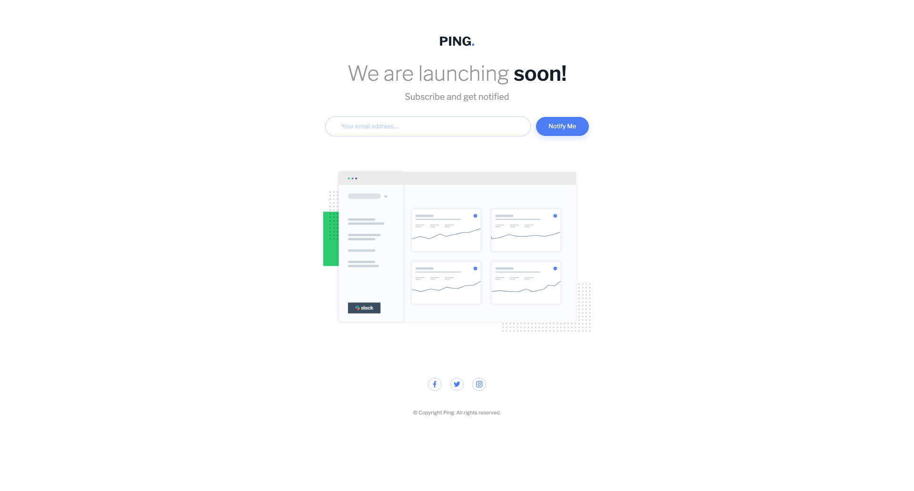

# Frontend Mentor - Ping coming soon page solution

This is a solution to the [Ping coming soon page challenge on Frontend Mentor](https://www.frontendmentor.io/challenges/ping-single-column-coming-soon-page-5cadd051fec04111f7b848da). Frontend Mentor challenges help you improve your coding skills by building realistic projects. 

## Table of contents

- [Frontend Mentor - Ping coming soon page solution](#frontend-mentor---ping-coming-soon-page-solution)
  - [Table of contents](#table-of-contents)
  - [Overview](#overview)
    - [The challenge](#the-challenge)
    - [Screenshot](#screenshot)
    - [Links](#links)
  - [My process](#my-process)
    - [Built with](#built-with)
    - [What I learned](#what-i-learned)
    - [Continued development](#continued-development)
    - [Useful resources](#useful-resources)
  - [Author](#author)

## Overview

### The challenge

Users should be able to:

- View the optimal layout for the site depending on their device's screen size
- See hover states for all interactive elements on the page
- Submit their email address using an `input` field
- Receive an error message when the `form` is submitted if:
    - The `input` field is empty. The message for this error should say *"Whoops! It looks like you forgot to add your email"*
    - The email address is not formatted correctly (i.e. a correct email address should have this structure: `name@host.tld`). The message for this error should say *"Please provide a valid email address"*

### Screenshot

### Links

- Solution URL: [GitHub](https://github.com/AlexanderTejedor/Intro-component-with-sign-up-form)
- Live Site URL: [GitHub Pages](https://alexandertejedor.github.io/Intro-component-with-sign-up-form/)

## My process

### Built with

- Semantic HTML5 markup
- CSS custom properties
- Flexbox
- CSS Grid
- Mobile-first workflow
- [React](https://reactjs.org/) - JS library
- [TailwindCSS](https://tailwindcss.com/) - CSS library
- [React Hook Form](https://react-hook-form.com/) - For the Forms

### What I learned

In this project, I not only learned how to integrate React with Tailwind, but also how to use React-Hook-Form an excellent tool for handling and validating forms, which was especially helpful for implementing form validation.

### Continued development

I will continue improving my skills with React and TailwindCSS to keep growing.

### Useful resources

- [Google Fonts](https://fonts.google.com/) - This helped me to use external fonts instead of local ones, so that everyone can identify the type of font I used for this challenge.
- [Remix Icons](https://remixicon.com/) - This helped me to the add icons in my website.

## Author

- Website - [Alexander Tejedor](https://github.com/AlexanderTejedor)
- Frontend Mentor - [@AlexanderTejedor](https://www.frontendmentor.io/profile/AlexanderTejedor)
- Twitter - [@Alexand59894016](https://x.com/Alexand59894016)
- Instagram - [_.alexDev._](https://www.instagram.com/_.alexdev._/?hl=es)